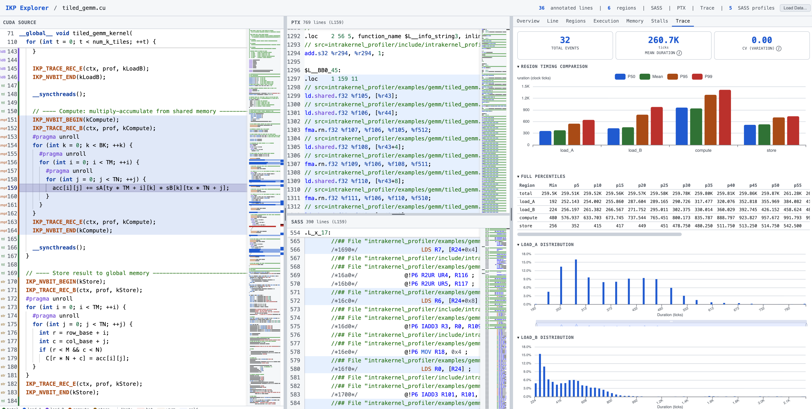
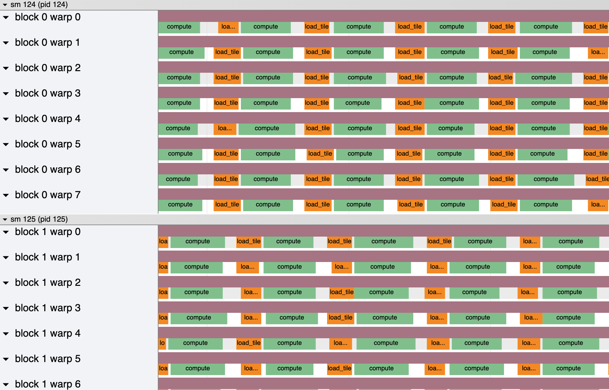
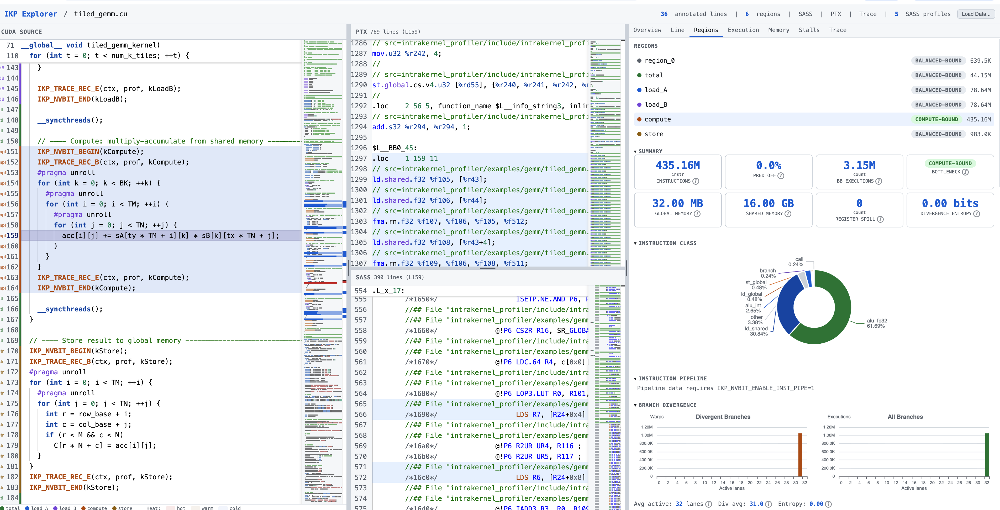
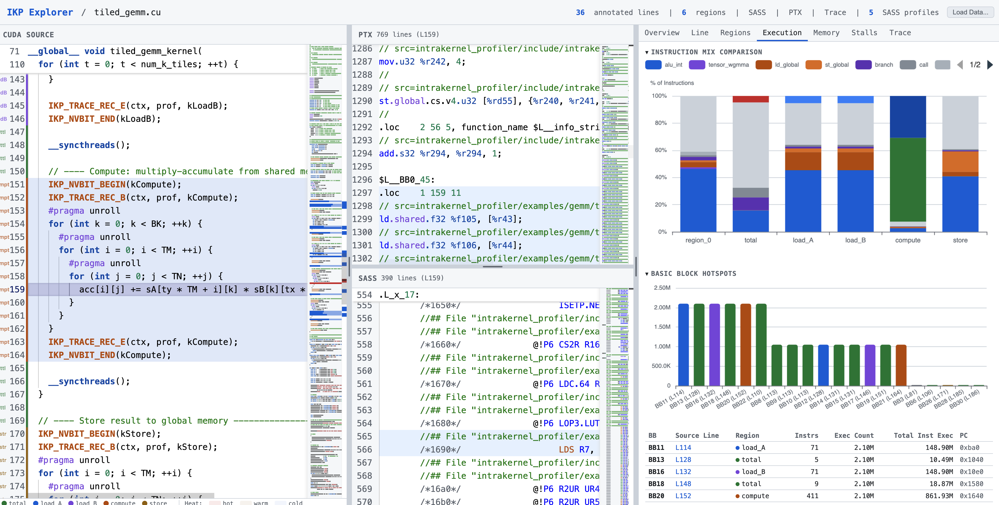
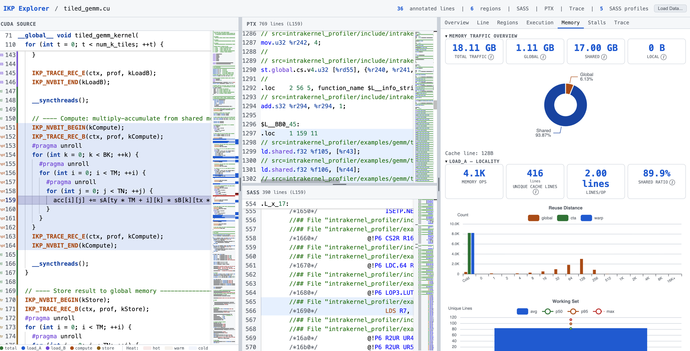
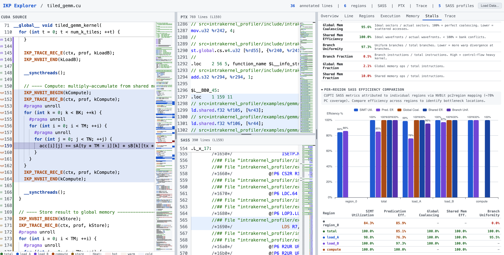

# Intra-Kernel Profiler (IKP)

**Region-level profiling for CUDA kernels.** Not global metrics — per-region metrics.

Most GPU profilers (Nsight, NV Perf SDK) give you a single number per kernel
launch: *this kernel executed 1.2T instructions, achieved 85% occupancy.*
IKP goes deeper. You instrument your kernel with named **regions** (e.g.,
`load_A`, `compute`, `store`), and every metric — instruction counts, memory
traffic, hardware counters, stall reasons, timing — is attributed to each region
independently. You see *which phase* of your kernel is bottlenecked, not just
that the kernel as a whole is slow.

IKP provides three complementary profiling backends — **Trace** (nanosecond
timing), **NVBit** (SASS-level instruction attribution), and **CUPTI** (hardware
counters) — all region-aware, all joinable. Results flow into the **IKP
Explorer**, a self-contained single-page HTML dashboard that shows every metric
broken down by region alongside the annotated source, PTX, and SASS.

<p align="center">

</p>

> **Try it now — no GPU required.**
> Pre-generated results from the tiled GEMM demo are checked in:
> [`examples/gemm/explorer.html`](examples/gemm/explorer.html) (interactive dashboard),
> [`examples/gemm/gemm_trace.json`](examples/gemm/gemm_trace.json) (open in [Perfetto](https://ui.perfetto.dev) or [chrome://tracing/](chrome://tracing/)), and
> [`examples/gemm/gemm_trace_summary.json`](examples/gemm/gemm_trace_summary.json).
> Serve the Explorer locally with `python3 -m http.server --directory examples/gemm 8080`
> and open `http://localhost:8080/explorer.html`.

---

## Table of Contents

- [Feature Overview](#feature-overview)
- [Installation](#installation)
- [Quick Start](#quick-start)
- [1. Trace Profiler](#1-trace-profiler) — per-warp nanosecond timing
- [2. NVBit Region Profiler](#2-nvbit-region-profiler) — SASS-level instruction attribution
- [3. CUPTI Collectors](#3-cupti-collectors) — hardware counter collection
- [4. IKP Explorer](#4-ikp-explorer) — interactive dashboard
- [5. Scripts & Tools](#5-scripts--tools) — analysis, merge, visualization
- [6. Tutorial — Profiling a Tiled GEMM](#6-tutorial--profiling-a-tiled-gemm)
- [Examples](#examples)
- [Project Layout](#project-layout)

---

## Feature Overview

### Trace — Per-warp nanosecond timing

Instrument your kernel with begin/end markers around named code regions. IKP
records 16-byte timestamped events into a per-warp lock-free ring buffer and
outputs **Chrome Trace JSON** you can drag-and-drop into
[Perfetto](https://ui.perfetto.dev) or [chrome://tracing/](chrome://tracing/), plus aggregate statistics (mean, CV,
percentiles, histograms).

<p align="center">

</p>

### NVBit — SASS-level instruction attribution

Binary instrumentation via [NVBit](https://github.com/NVlabs/NVBit) attributes
every executed SASS instruction to your named source regions. Produces
instruction class/pipeline breakdowns, branch divergence analysis, memory access
traces, basic-block hotspots, and PC-to-region mappings.

### CUPTI — Hardware counter collection

Four injection-based collectors gather per-PC hardware data with no source
changes: **PC sampling** (stall reasons), **SASS metrics** (5 hardware counter
profiles), **instruction execution** (thread counts + predication), and
**PM sampling** (Hopper+). These are joined with NVBit's PC-to-region map to
produce per-region hardware metrics.

### IKP Explorer — Interactive dashboard

A single-page HTML dashboard combining source code (Monaco Editor), disassembled
SASS, and every profiler metric into 7 interactive tabs:

| Tab | What it shows |
|-----|---------------|
| **Overview** | Kernel summary, bottleneck badges, data quality |
| **Line** | Per-source-line metrics (click any line) |
| **Regions** | Full per-region detail — 40+ fields, charts for branch divergence, memory efficiency, bank conflicts |
| **Execution** | Instruction mix comparison, BB hotspots, branch site analysis |
| **Memory** | Reuse distance, working set, inter-warp sharing, locality |
| **Stalls** | SASS efficiency metrics (coalescing, predication, branch uniformity), per-region efficiency comparison table |
| **Trace** | Duration histograms, full percentile tables, per-block/warp heatmaps |

<details>
<summary><b>Explorer screenshots</b> (click to expand)</summary>

**Regions** — per-region bottleneck badges, instruction class breakdown, branch divergence chart:
<p align="center">

</p>

**Execution** — stacked instruction mix comparison across regions, basic-block hotspot bar chart and table:
<p align="center">

</p>

**Memory** — total traffic overview (global/shared/local), per-region locality stats, reuse distance histogram, working set curve:
<p align="center">

</p>

**Stalls** — SASS efficiency metrics (coalescing, predication, branch uniformity), per-region efficiency comparison chart and table:
<p align="center">

</p>

</details>

---

## Installation

IKP has three tiers of dependencies:

| Tier | What you need | What you get |
|------|---------------|--------------|
| **Trace only** | CUDA Toolkit + C++17 compiler | Per-warp timing, Chrome Trace output |
| **+ CUPTI tools** | Above + CUPTI (bundled with CUDA) | PC sampling, SASS metrics, instrexec |
| **+ NVBit tool** | Above + [NVBit](https://github.com/NVlabs/NVBit) | PC→region mapping, instruction mix, memory trace |

**Quick install check:**

```bash
nvcc --version                                          # CUDA
ls $CUDA_HOME/extras/CUPTI/include/cupti.h              # CUPTI
ls $NVBIT_PATH/core/libnvbit.a                          # NVBit (optional)
```

**Build everything:**

```bash
# Core (trace examples)
cmake -S . -B build -DCMAKE_BUILD_TYPE=Release && cmake --build build -j

# CUPTI collectors
make -C tools/cupti_region_profiler -j

# NVBit tool (optional, requires NVBIT_PATH)
make -C tools/nvbit_region_profiler NVBIT_PATH=$NVBIT_PATH ARCH=90a -j
```

For detailed installation steps (CUDA Toolkit, GCC from source, NVBit download,
CUPTI troubleshooting, HPC cluster notes), see **[`docs/install.md`](docs/install.md)**.

---

## Quick Start

```cpp
#include <intra_kernel_profiler/intra_kernel_profiler.hpp>

__global__ void MyKernel(intra_kernel_profiler::trace::GlobalBuffer prof) {
  IKP_TRACE_CTX_TYPE(4096, 8) ctx;      // ring buffer: 4096 events, 8 warps/block
  IKP_TRACE_CTX_INIT(ctx);

  IKP_TRACE_REC_B(ctx, prof, 0);        // begin region 0
  // ... your GPU work ...
  IKP_TRACE_REC_E(ctx, prof, 0);        // end region 0

  IKP_TRACE_CTX_FLUSH(ctx, prof);
}
```

```cpp
// Host side
intra_kernel_profiler::trace::HostSession sess;
sess.set_region_names({"my_work"});
sess.init(/*cap=*/4096, /*grid_x=*/grid.x, /*threads_per_block=*/block.x);
sess.reset();

MyKernel<<<grid, block>>>(sess.global_buffer());
cudaDeviceSynchronize();
sess.write_trace("trace.json");   // open in https://ui.perfetto.dev
```

```bash
# Build
cmake -S . -B build -DCMAKE_BUILD_TYPE=Release && cmake --build build -j
./build/ikp_gemm_demo           # tiled GEMM profiling example
```

---

## 1. Trace Profiler

### What it does

Records nanosecond-resolution begin/end timestamps per warp per named region
into a lock-free per-warp ring buffer on the device. After kernel completion,
the host session pairs events, computes statistics, and writes Chrome Trace
JSON + summary JSON.

### How it works

- **Device side:** Each warp has a dedicated circular buffer slot. Only lane 0
  (the warp leader) records, via a single `st.global.cs.v4.u32` streaming store
  per event. Each event is 16 bytes: `{timestamp, region_id, type, block, warp|smid}`.
- **Host side:** `HostSession` allocates device memory, collects events after
  `cudaDeviceSynchronize()`, pairs begin/end events, and emits Chrome Trace
  complete events (`ph:"X"`).
- **Overhead:** ~5 globaltimer reads + streaming stores per region per iteration.
  Typically <1% kernel slowdown.

### Usage

```cpp
#include <intra_kernel_profiler/intra_kernel_profiler.hpp>

#define PROFILE_CAP 8192
constexpr uint32_t kWarpsPerBlock = (THREADS + 31) / 32;

__global__ void tiled_gemm_kernel(..., intra_kernel_profiler::trace::GlobalBuffer prof) {
  IKP_TRACE_CTX_TYPE(PROFILE_CAP, kWarpsPerBlock) ctx;
  IKP_TRACE_CTX_INIT(ctx);

  IKP_TRACE_REC_B(ctx, prof, 0);              // total
  for (int t = 0; t < num_k_tiles; ++t) {
    IKP_TRACE_REC_B(ctx, prof, 1);            // load_tile
    // ... load A and B ...
    IKP_TRACE_REC_E(ctx, prof, 1);

    __syncthreads();

    IKP_TRACE_REC_B(ctx, prof, 2);            // compute
    // ... multiply-accumulate ...
    IKP_TRACE_REC_E(ctx, prof, 2);

    __syncthreads();
  }
  IKP_TRACE_REC_B(ctx, prof, 3);              // store
  // ... write back C ...
  IKP_TRACE_REC_E(ctx, prof, 3);
  IKP_TRACE_REC_E(ctx, prof, 0);

  IKP_TRACE_CTX_FLUSH(ctx, prof);
}
```

Host:

```cpp
intra_kernel_profiler::trace::HostSession sess;
sess.set_region_names({"total", "load_tile", "compute", "store"});
sess.set_block_filter({0, 1, 2, 3});     // trace only 4 blocks
sess.init(PROFILE_CAP, total_blocks, THREADS);
sess.reset();

tiled_gemm_kernel<<<grid, block>>>(..., sess.global_buffer());
cudaDeviceSynchronize();

intra_kernel_profiler::trace::TraceWriteOptions opt;
opt.scale = 1.0;                          // globaltimer ticks (≈ ns)
opt.emit_summary_json = true;
opt.summary_hist_bins = 128;
opt.summary_dump_by_block_warp = true;
sess.write_trace("gemm_trace.json", opt);
```

### Device-side API

| Macro | Description |
|-------|-------------|
| `IKP_TRACE_CTX_TYPE(CAP, WARPS)` | Declare per-warp ring-buffer context. `CAP` must be power of 2 |
| `IKP_TRACE_CTX_INIT(ctx)` | Initialize (call once at kernel start) |
| `IKP_TRACE_REC_B(ctx, prof, id)` | Record begin event for region `id` |
| `IKP_TRACE_REC_E(ctx, prof, id)` | Record end event for region `id` |
| `IKP_TRACE_REC_M(ctx, prof, id)` | Record instant mark |
| `IKP_TRACE_REC_IF(ctx, prof, id, type, cond)` | Conditional recording (for sampling in tight loops) |
| `IKP_TRACE_CTX_FLUSH(ctx, prof)` | Flush ring-buffer counter to host (call at kernel end) |

### Host-side API

| Method | Description |
|--------|-------------|
| `sess.set_region_names({"r0", "r1", ...})` | Name regions for trace output |
| `sess.set_block_filter({0, 1, 2})` | Trace only selected blocks |
| `sess.clear_block_filter()` | Remove filter (trace all blocks) |
| `sess.init(cap, grid_x, threads)` | Allocate device buffers |
| `sess.reset()` | Zero counters for new run |
| `sess.global_buffer()` | Get `GlobalBuffer` to pass to kernel |
| `sess.write_trace(path, opt)` | Post-process and write output files |

### TraceWriteOptions

| Option | Default | Description |
|--------|---------|-------------|
| `scale` | `1.0` | Multiply raw ticks (1.0 = ns, 1e-3 = us, 1e-6 = ms) |
| `emit_complete_events` | `true` | Emit paired `ph:"X"` events |
| `group_by_smid` | `true` | pid = SM ID (false: pid = block ID) |
| `emit_summary_json` | `true` | Write `*_summary.json` alongside trace |
| `summary_hist_bins` | `128` | Histogram bins in summary |
| `summary_dump_by_block_warp` | `true` | Per-block, per-warp breakdown |

### Output format

**Chrome Trace JSON** (`*_trace.json`) — open in [Perfetto](https://ui.perfetto.dev):

```json
{
  "name": "compute",
  "ph": "X",
  "ts": 1234.0,
  "dur": 758.0,
  "pid": 124,         // SM ID
  "tid": 2,           // (block << 6) | warp
  "args": {"sm": 124, "block": 0, "warp": 2}
}
```

**Summary JSON** (`*_summary.json`):

```json
{
  "unmatched_begin": 0,
  "unmatched_end": 0,
  "regions": [
    {
      "name": "compute",
      "count": 2048,
      "mean_dur": 758.0,
      "cv_dur": 0.12,
      "min_dur": 544.0,
      "max_dur": 1408.0,
      "percentiles": {"p5": 640, "p10": 672, "p50": 767, "p95": 830, "p99": 1024},
      "hist": {"bins": 128, "min": 544.0, "max": 1408.0, "prob": [0.01, ...]}
    }
  ],
  "by_block_warp_regions": [...]
}
```

> **Capacity sizing:** Each warp records `2 * regions_per_iteration * iterations + 2 * (outer regions)` events. For a GEMM with 64 K-tiles and 2 inner regions: `2*2*64 + 2*2 = 260`. `PROFILE_CAP=8192` is plenty. If `unmatched_begin > 0`, increase `PROFILE_CAP`.

For detailed format spec, see [`docs/trace_format.md`](docs/trace_format.md). For profiling tips, see [`docs/trace_tips.md`](docs/trace_tips.md).

---

## 2. NVBit Region Profiler

### What it does

Binary instrumentation via [NVBit](https://github.com/NVlabs/NVBit) that
attributes every executed SASS instruction to your named source regions. Produces
PC-to-region mappings, per-region instruction counts (40+ fields), branch
divergence analysis, memory access traces, basic-block hotspots, and
disassembled SASS listings.

### How it works

- **Markers:** You compile with `-DIKP_ENABLE_NVBIT_MARKERS` and link
  `src/nvbit_marker_device.cu` (requires `-rdc=true`). This inserts
  `__noinline__` device function calls (`ikp_nvbit_region_push_N` /
  `ikp_nvbit_region_pop_N`) at region boundaries.
- **NVBit tool:** Loaded via `LD_PRELOAD`, the tool intercepts every kernel
  launch, identifies marker call sites in the SASS, and maintains a per-warp
  region stack at runtime. Every executed instruction is attributed to its
  enclosing region.
- **PC-to-region mapping:** The `pc2region_*.json` file maps every SASS PC to
  a region ID. This is the bridge that lets CUPTI per-PC data be joined to
  named regions.
- **Overhead:** `pcmap` mode ~5-10%. `memtrace` mode is expensive (50%+
  unsampled); use `IKP_NVBIT_SAMPLE_MEM_EVERY_N=8` for ~5-10%.

### Usage

**Step 1: Build the target with NVBit markers**

```bash
nvcc -O3 -std=c++17 -arch=sm_90a -rdc=true -lineinfo \
  -DIKP_ENABLE_NVBIT_MARKERS -I include \
  your_kernel.cu src/nvbit_marker_device.cu \
  -o your_kernel_nvbit
```

**Step 2: Build the NVBit tool**

```bash
make -C tools/nvbit_region_profiler NVBIT_PATH=$NVBIT_PATH ARCH=90a -j
```

**Step 3: Run**

```bash
IKP_NVBIT_ENABLE=1 \
IKP_NVBIT_KERNEL_REGEX=your_kernel_name \
IKP_NVBIT_MODE=pcmap \
IKP_NVBIT_TRACE_PATH=./nvbit_out \
LD_PRELOAD=tools/nvbit_region_profiler/region_profiler.so \
./your_kernel_nvbit
```

### NVBit marker API

```cpp
#include <intra_kernel_profiler/nvbit/markers.cuh>

// In kernel — build with -DIKP_ENABLE_NVBIT_MARKERS -rdc=true
IKP_NVBIT_BEGIN(region_id);   // push region (0-6)
// ... GPU work ...
IKP_NVBIT_END(region_id);     // pop region
```

When `IKP_ENABLE_NVBIT_MARKERS` is not defined, these compile to no-ops.

### Modes

| Mode | Env Vars | What it collects | Output files |
|------|----------|------------------|--------------|
| **pcmap** | `IKP_NVBIT_MODE=pcmap` | PC→region mapping, per-region instruction counts | `pc2region_*.json`, `region_stats_*.json` |
| **all** | `IKP_NVBIT_MODE=all` | pcmap + sampled memory trace | Above + `mem_trace_*.jsonl` |
| **pcmap + inst_pipe** | `+IKP_NVBIT_ENABLE_INST_PIPE=1` | Per-pipeline instruction counts (16 categories) | Added to `region_stats` |
| **pcmap + bb_hot** | `+IKP_NVBIT_ENABLE_BB_HOT=1` | Basic-block execution hotspots | `hotspots_*.json` |
| **pcmap + branch** | `+IKP_NVBIT_ENABLE_BRANCH_SITES=1` | Per-branch taken/fallthrough + divergence | Added to `region_stats` |
| **SASS dump** | `+IKP_NVBIT_DUMP_NVDISASM_SASS=1 IKP_NVBIT_DUMP_SASS_META=1` | High-quality disassembled SASS with metadata | `sass_all_*.sass` |
| **PTX dump** | `+IKP_NVBIT_DUMP_PTX=1 IKP_NVBIT_DUMP_PTX_BY_REGION=1` | PTX listing per region | PTX files |

### Environment variables

| Variable | Default | Description |
|----------|---------|-------------|
| `IKP_NVBIT_ENABLE` | `0` | Activate tool |
| `IKP_NVBIT_KERNEL_REGEX` | `.*` | Kernel name filter (regex) |
| `IKP_NVBIT_TRACE_PATH` | `.` | Output directory |
| `IKP_NVBIT_MODE` | `pcmap` | `pcmap`, `instmix`, `memtrace`, or `all` |
| `IKP_NVBIT_TRACE_CAP` | `4096` | Memory trace buffer capacity |
| `IKP_NVBIT_SAMPLE_MEM_EVERY_N` | `1` | Sample 1 in N memory ops (8 recommended) |
| `IKP_NVBIT_ENABLE_INST_PIPE` | `0` | Collect per-pipeline instruction counts |
| `IKP_NVBIT_ENABLE_BB_HOT` | `0` | Collect basic-block hotspots |
| `IKP_NVBIT_ENABLE_BRANCH_SITES` | `0` | Collect branch divergence per site |
| `IKP_NVBIT_DUMP_NVDISASM_SASS` | `0` | Dump SASS via nvdisasm |
| `IKP_NVBIT_DUMP_SASS_META` | `0` | Include SASS metadata |
| `IKP_NVBIT_DUMP_SASS_LINEINFO` | `0` | Include source line correlation |
| `IKP_NVBIT_DUMP_PTX` | `0` | Dump PTX |
| `IKP_NVBIT_DUMP_PTX_BY_REGION` | `0` | Split PTX by region |

### Output format

**`region_stats_*.json`** — per-region instruction and memory statistics (40+ fields):

```json
{
  "1": {
    "inst_total": 1234567,
    "inst_pred_off": 12345,
    "inst_class": {
      "alu_fp32": 500000, "alu_int": 200000, "tensor_wgmma": 0,
      "ld_global": 100000, "st_global": 50000, "ld_shared": 80000,
      "st_shared": 40000, "barrier": 10000, "branch": 20000, ...
    },
    "inst_pipe": {"ALU": 700000, "FMA": 300000, "LSU": 150000, ...},
    "gmem_load": 100000, "gmem_store": 50000, "gmem_bytes": 19200000,
    "gmem_req_bytes": 19200000, "gmem_sectors_32b": 600000,
    "gmem_alignment_hist": [590000, 5000, 3000, 1000, 500, 300, 100, 100],
    "gmem_stride_class_hist": [550000, 30000, 20000],
    "smem_load": 80000, "smem_store": 40000, "smem_bytes": 9600000,
    "smem_bank_conflict_max_hist": [70000, 8000, 1500, 300, ...],
    "branch_div_hist": [0, 0, ..., 20000],
    "branch_active_hist": [0, 0, ..., 20000],
    "branch_div_entropy": 0.15,
    "bb_exec": {"0": 50000, "1": 48000, ...},
    "reg_spill_suspected": 0
  }
}
```

**`pc2region_*.json`** — PC-to-region mapping (used for CUPTI join):

```json
{
  "0x00000100": 1,
  "0x00000110": 1,
  "0x00000120": 2,
  ...
}
```

For detailed field definitions, see [`docs/nvbit_guide.md`](docs/nvbit_guide.md).

---

## 3. CUPTI Collectors

### What they do

Four injection-based collectors gather per-PC hardware data without source
changes. Loaded via `CUDA_INJECTION64_PATH`, they hook into the CUDA driver
at runtime — no replay, no serialization, near-native speed.

The key use case is **joining with NVBit**: CUPTI provides per-PC hardware
metrics; NVBit provides PC-to-region mappings. Together they give you
region-level hardware performance data.

### How it works

- **Injection:** Set `CUDA_INJECTION64_PATH` to the `.so` file. CUPTI
  intercepts CUDA driver calls and collects data transparently.
- **No source changes:** The target binary is compiled normally (just add
  `-lineinfo` for source mapping). No markers needed.
- **Per-PC aggregation:** Results are aggregated per program counter and written
  as JSON on process exit.

### Collectors

#### 3.1 PC Sampling — Stall reason breakdown

Statistical sampling of the program counter with stall reason attribution. Shows
*where* warps are stalling and *why* (barrier, memory, scoreboard, etc.).

```bash
CUDA_INJECTION64_PATH=tools/cupti_region_profiler/ikp_cupti_pcsamp.so \
IKP_CUPTI_PCSAMP_OUT=./pcsampling_raw.json \
IKP_CUPTI_PCSAMP_KERNEL_REGEX=your_kernel \
./your_kernel
```

| Variable | Default | Description |
|----------|---------|-------------|
| `IKP_CUPTI_PCSAMP_OUT` | required | Output JSON path |
| `IKP_CUPTI_PCSAMP_KERNEL_REGEX` | `.*` | Kernel filter |
| `IKP_CUPTI_PCSAMP_COLLECTION_MODE` | `serialized` | `serialized` or `concurrent` |
| `IKP_CUPTI_PCSAMP_PERIOD` | `5` | Sample every N interrupts |
| `IKP_CUPTI_PCSAMP_MAX_PCS` | `10000` | Max unique PCs |

Output: per-PC stall reason sample counts + stall reason name table.

#### 3.2 SASS Metrics — Hardware counter profiles

Exact per-PC hardware counters collected via CUPTI code patching. Five
pre-defined profiles cover different metric groups:

| Profile | Key Metrics |
|---------|-------------|
| `core` | `smsp__sass_inst_executed`, `smsp__sass_thread_inst_executed` |
| `divergence` | `smsp__sass_thread_inst_executed_pred_on`, divergence ratio |
| `memory` | Memory throughput, L1/L2 hit rates |
| `instruction_mix` | Per-opcode instruction counts |
| `branch` | Branch-related counters |

```bash
CUDA_INJECTION64_PATH=tools/cupti_region_profiler/ikp_cupti_sassmetrics.so \
IKP_CUPTI_SASS_OUT=./sassmetrics_core.json \
IKP_CUPTI_SASS_PROFILE=core \
IKP_CUPTI_SASS_LAZY_PATCHING=1 \
IKP_CUPTI_SASS_ENABLE_SOURCE=1 \
./your_kernel
```

| Variable | Default | Description |
|----------|---------|-------------|
| `IKP_CUPTI_SASS_OUT` | required | Output JSON path |
| `IKP_CUPTI_SASS_PROFILE` | required | `core`, `divergence`, `memory`, `instruction_mix`, or `branch` |
| `IKP_CUPTI_SASS_LAZY_PATCHING` | `0` | Only patch profiled kernels (faster) |
| `IKP_CUPTI_SASS_ENABLE_SOURCE` | `0` | Include source file/line (requires `-lineinfo`) |

Output: per-PC metric values + optional source mapping.

#### 3.3 Instruction Execution — Thread counts + predication

Per-PC thread execution counts and predication analysis.

```bash
CUDA_INJECTION64_PATH=tools/cupti_region_profiler/ikp_cupti_instrexec.so \
IKP_CUPTI_INSTREXEC_OUT=./instrexec_raw.json \
IKP_CUPTI_INSTREXEC_KERNEL_REGEX=your_kernel \
./your_kernel
```

#### 3.4 PM Sampling (Hopper+)

Performance monitor sampling for CUDA 12.6+ on Hopper and newer.

```bash
CUDA_INJECTION64_PATH=tools/cupti_region_profiler/ikp_cupti_pmsamp.so \
IKP_CUPTI_PMSAMP_OUT=./pmsamp_raw.json \
./your_kernel
```

### NVBit + CUPTI Join

The most powerful workflow: NVBit tells you *which PC belongs to which region*;
CUPTI tells you *what each PC costs*. The join produces per-region hardware
metrics:

```bash
python3 scripts/analyze_cupti_join.py \
  --nvbit-dir ./nvbit_out \
  --cupti-dir ./cupti_out \
  --labels "0:outside,1:compute,2:store"
```

For detailed collector documentation, see [`docs/cupti_guide.md`](docs/cupti_guide.md).

---

## 4. IKP Explorer

### How it's generated

`scripts/generate_explorer.py` is a Python script that reads all profiler outputs
and bakes them into a **single self-contained HTML file** — no server, no
external dependencies, no network required after generation.

What the script does:

1. **Reads source** from `--source` (your `.cu` file). Annotates each line with
   the set of SASS PCs that map to it (via nvdisasm lineinfo or CUPTI source mapping).
2. **Reads PTX** from `nvbit/ptx/ptx_all_*.ptx` (produced by `IKP_NVBIT_DUMP_PTX=1`).
3. **Reads SASS** from `nvbit/nvdisasm/nvdisasm_*.sass` (high-quality, with
   metadata and lineinfo), falling back to `nvbit/pcmap/sass_all_*.sass`.
4. **Reads all JSON data** — trace summary, NVBit region stats, pc2region map,
   hotspots, memory trace locality, CUPTI SASS metrics, PC sampling, instrexec —
   and embeds them as inline JavaScript objects.
5. **Inlines Monaco Editor** (the VS Code editor engine) from CDN references, so
   the source/PTX/SASS panels have full syntax highlighting and line linking.
6. **Writes a single `.html` file** that contains all data and all UI logic. The
   file is fully offline-capable once generated (except Monaco, which loads from
   CDN on first open).

Two scripts generate this directory structure automatically:

- **`scripts/run_all_examples.sh`** — runs every example (trace, CUPTI, NVBit,
  region demo, post-processing). Outputs to `_demo_out/` by default.
- **`examples/gemm/run.sh`** — runs the full pipeline for the GEMM example only.
  Outputs to `examples/gemm/_out/`.

```bash
# Option 1: run ALL examples (generates _demo_out/)
bash scripts/run_all_examples.sh --nvbit-path=$NVBIT_PATH

# Option 2: run GEMM example only (generates examples/gemm/_out/)
bash examples/gemm/run.sh --nvbit-path=$NVBIT_PATH

# Option 3: generate Explorer from an existing output directory
python3 scripts/generate_explorer.py \
  --demo-dir _demo_out \
  --source examples/gemm/tiled_gemm.cu \
  --output explorer.html
```

Key options:

| Option | Description |
|--------|-------------|
| `--demo-dir DIR` | Root directory containing `trace/`, `nvbit/`, `cupti/` subdirs |
| `--source FILE` | Path to the kernel `.cu` source file |
| `--output FILE` | Output HTML path (relative paths are joined with `--demo-dir`) |
| `--nvdisasm FILE` | Override SASS source with a specific nvdisasm dump |
| `--serve` | Start a local HTTP server and open the Explorer in a browser after generation |

The Explorer reads from a structured output directory:

```
_demo_out/                             # generated by: bash scripts/run_all_examples.sh
├── trace/
│   ├── gemm_trace.json              # Chrome Trace
│   └── gemm_trace_summary.json      # summary statistics
├── nvbit/
│   ├── pc2region_*.json             # PC → region mapping
│   ├── region_stats_*.json          # per-region 40+ fields
│   ├── hotspots_*.json              # BB hotspots
│   ├── sass_all_*.sass              # disassembled SASS
│   └── mem_trace_*.jsonl            # memory access trace
├── cupti/
│   ├── pcsampling_raw.json          # PC sampling
│   ├── sassmetrics_core.json        # SASS metrics (5 profiles)
│   ├── sassmetrics_divergence.json
│   ├── sassmetrics_memory.json
│   ├── sassmetrics_instruction_mix.json
│   ├── sassmetrics_branch.json
│   └── instrexec_raw.json           # instruction execution
└── locality/
    └── locality_analysis.json       # reuse distance, working set
```

Each tab gracefully degrades — if a data source is missing, the tab shows what's
available with hints about how to collect the missing data.

### Using the Explorer

The left panel shows annotated **CUDA source** (click any highlighted line to
filter all charts to that line's PC range). The middle panel shows **PTX** or
**SASS** depending on the active tab. The right panel is the analytics area.

**Typical workflow:**

1. **Overview** — start here. Check the bottleneck badges (compute-bound /
   memory-bound) and data-quality warnings. The kernel summary shows total
   instruction count, global/shared memory traffic, and mean region durations.

2. **Regions** — select a region from the list to drill into it. The instruction
   class donut shows the breakdown (FP32, FP64, tensor, ld/st global, ld/st
   shared, barrier, branch, …). The branch divergence chart shows per-warp
   divergence distribution. Requires NVBit pcmap data.

3. **Execution** — compare instruction mix across all regions side-by-side
   (stacked bar). Identify which regions dominate execution. The basic-block
   hotspot chart shows the most-executed BBs; click a row to jump to its SASS
   PC. Requires NVBit pcmap + bb_hot data.

4. **Memory** — check global vs. shared vs. local traffic split. Per-region
   locality stats show unique cache lines, lines-per-op, and inter-warp sharing
   ratio. The reuse distance histogram and working set curve help identify
   cache-unfriendly access patterns. Requires NVBit memtrace data.

5. **Stalls** — view SASS efficiency metrics per region: SIMT utilization,
   predication efficiency, global memory coalescing, shared memory efficiency,
   and branch uniformity. The per-region comparison table ranks regions by
   efficiency. Requires CUPTI SASS metrics data.

6. **Trace** — inspect timing variability. The region timing comparison chart
   shows P50/P95/P99 bars per region. The full percentile table and per-region
   duration histograms reveal whether variance is SM-level (scheduling jitter)
   or instruction-level (data-dependent). Requires Trace JSON.

7. **Line** — click any source line to see all metrics attributed to that line:
   instruction count, memory ops, stall samples, SASS PC range. Useful for
   pinpointing a specific line within a region.

**Loading data:** Click **Load Data…** (top-right) to load additional JSON files
into a running Explorer session without regenerating the HTML.

---

## 5. Scripts & Tools

### Analysis scripts

| Script | Purpose |
|--------|---------|
| `scripts/generate_explorer.py` | **IKP Explorer** — primary interactive dashboard |
| `scripts/analyze_cupti_join.py` | Join NVBit pc2region with CUPTI per-PC metrics |
| `scripts/nvbit_locality.py` | Memory locality analysis (reuse distance, working set) from NVBit mem_trace |
| `scripts/annotate_source.py` | Annotate kernel source with per-line SASS metrics |
| `scripts/validate_json.py` | Validate and pretty-print profiler output JSON |
| `scripts/pin_env.sh` | Lock GPU clocks and capture environment for reproducibility |

### Merge scripts (for multi-run aggregation)

| Script | Purpose |
|--------|---------|
| `scripts/ikp_cupti_pcsamp_merge.py` | Merge multiple PC sampling runs |
| `scripts/ikp_cupti_sassmetrics_merge.py` | Merge SASS metrics across profiles |
| `scripts/ikp_cupti_divergence_merge.py` | Merge divergence metrics |

### Visualization scripts

| Script | Purpose |
|--------|---------|
| `scripts/generate_gallery.py` | Publication-quality static charts (matplotlib) |
| `scripts/ikp_viz_mpl.py` | Matplotlib dashboard (regions + memory + locality) |
| `scripts/plot_trace_summary.py` | Plot per-region duration histograms |

### One-command pipeline

```bash
# Build, run every example, collect all data, generate reports (outputs to _demo_out/)
bash scripts/run_all_examples.sh --nvbit-path=$NVBIT_PATH

# Or just the GEMM example (outputs to examples/gemm/_out/)
bash examples/gemm/run.sh --nvbit-path=$NVBIT_PATH
```

---

## 6. Tutorial — Profiling a Tiled GEMM

For a complete step-by-step walkthrough — build two binaries, run every trace /
NVBit / CUPTI profiling mode, generate the Explorer, and inspect the results —
see **[`tutorial.md`](tutorial.md)**.

The GEMM example pipeline can also be run as a single command:

```bash
bash examples/gemm/run.sh --nvbit-path=$NVBIT_PATH
```

This runs all 5 steps (trace, 5 NVBit modes, 5 CUPTI profiles + PC sampling +
instrexec, locality analysis, Explorer generation) and produces
`examples/gemm/_out/explorer.html`.

**No GPU? No problem.** Pre-generated outputs are checked in at
[`examples/gemm/explorer.html`](examples/gemm/explorer.html),
[`examples/gemm/gemm_trace.json`](examples/gemm/gemm_trace.json), and
[`examples/gemm/gemm_trace_summary.json`](examples/gemm/gemm_trace_summary.json).
Open `explorer.html` via a local HTTP server to browse a real profiling result immediately.

For a shorter walkthrough focused on the trace instrumentation only, see
[`docs/gemm_walkthrough.md`](docs/gemm_walkthrough.md).

---

## Examples

| Example | What it shows | Run |
|---------|---------------|-----|
| [`examples/trace/`](examples/trace/) | Basic trace: record, block filter, sampled loop | `bash examples/trace/run.sh` |
| [`examples/gemm/`](examples/gemm/) | Full pipeline: tiled GEMM with all profilers | `bash examples/gemm/run.sh --nvbit-path=$NVBIT_PATH` |
| [`examples/nvbit/`](examples/nvbit/) | NVBit marker target: all 6 modes | `bash examples/nvbit/run.sh` |
| [`examples/cupti/`](examples/cupti/) | CUPTI injection target: all collectors | `bash examples/cupti/run.sh` |
| [`examples/region_demo/`](examples/region_demo/) | NVBit+CUPTI join workflow | `bash examples/region_demo/run.sh` |

> **Pre-generated outputs:** [`examples/gemm/`](examples/gemm/) ships with pre-built results —
> [`gemm_trace.json`](examples/gemm/gemm_trace.json),
> [`gemm_trace_summary.json`](examples/gemm/gemm_trace_summary.json), and
> [`explorer.html`](examples/gemm/explorer.html) — so you can browse the Explorer and
> inspect a real trace immediately, without running any profiling.

---

## Project Layout

```
intra_kernel_profiler/
├── include/intra_kernel_profiler/
│   ├── intra_kernel_profiler.hpp   # single include
│   ├── trace/
│   │   ├── event.cuh              # 16B event struct
│   │   ├── device_ctx.cuh         # per-warp ring buffer
│   │   ├── host_session.hpp       # host collection + trace writer
│   │   └── macros.cuh             # IKP_TRACE_* convenience macros
│   └── nvbit/markers.cuh          # NVBit region markers
├── src/
│   └── nvbit_marker_device.cu     # marker device functions
├── tools/
│   ├── nvbit_region_profiler/     # NVBit tool (.so)
│   └── cupti_region_profiler/     # CUPTI collectors (4 .so files)
├── examples/
│   ├── gemm/                      # tiled GEMM (full pipeline)
│   ├── trace/                     # basic trace examples
│   ├── nvbit/                     # NVBit marker target
│   ├── cupti/                     # CUPTI injection target
│   └── region_demo/               # NVBit + CUPTI join
├── scripts/                       # Python analysis + visualization
├── docs/                          # guides + gallery
└── tutorial.md                    # step-by-step walkthrough
```

---

## License

Apache 2.0. See [LICENSE](LICENSE).
